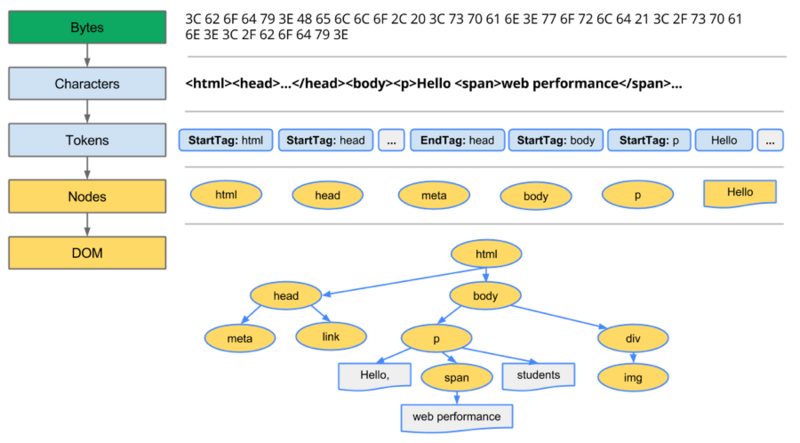
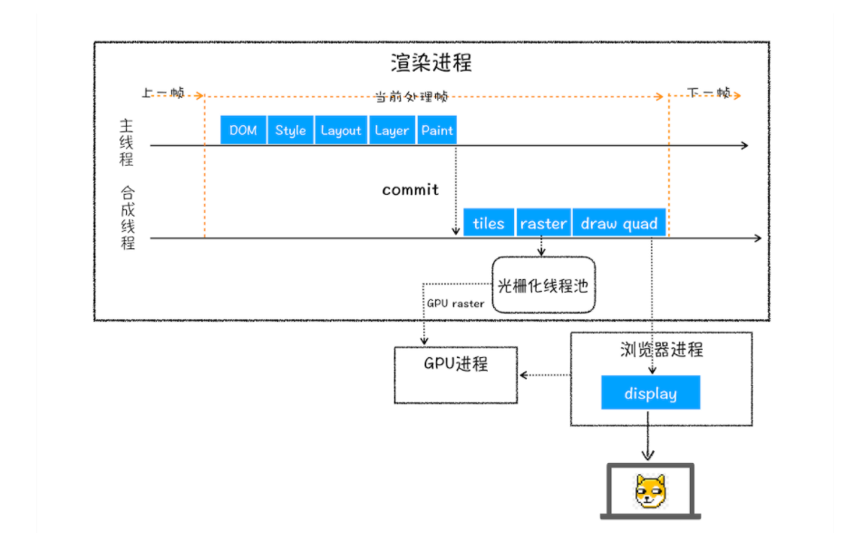
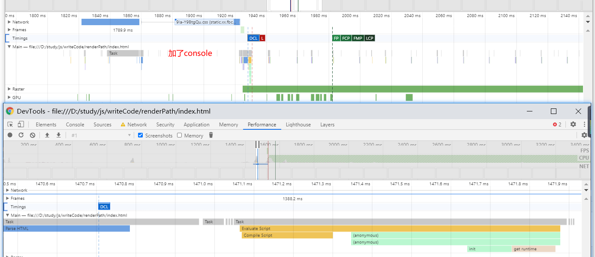
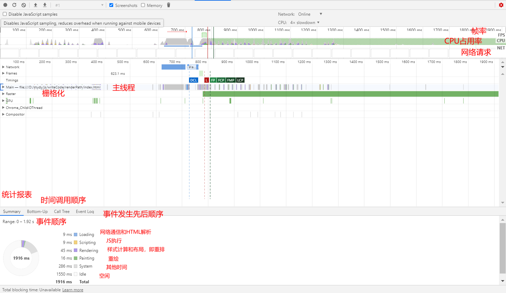

# 关键渲染路径


关键渲染路径就是将HTML,CSS,JavaScript文件转化成漂亮页面的过程

## DOM 生成

为什么要构建 DOM 树呢？**这是因为浏览器无法直接理解和使用 HTML，所以需要将 HTML 转换为浏览器能够理解的结构——DOM 树**。

浏览器会遵守一套定义完善的步骤来处理HTML并构建DOM：


### 第一步：转换

浏览器从磁盘或网络读取HTML的原始字节，并根据文件的指定编码（例如 UTF-8）将它们转换成字符，

```HTML
3C 62 6F 64 79 3E 48 65 6C 6C  => <html><head>... </head><body>
```

### 第二步:Token化

将字符串转换成Token，例如：“`<html>`”、“`<body>`”等。Token中会标识出当前Token是“开始标签”或是“结束标签”亦或是“文本”等信息。

```HTML
<html><head>... </head><body>
```
​     ↓

 `StartTag: html` 、 `StartTag: head` 、``..`` 、`EndTag: head`、`StartTag: body`

其内部实现是通过维护一个栈，遇到start压入栈，遇到end弹出，节点与节点之间的关系通过标签的闭合辨别，比如两个相同标签的start和end内的元素都是其子元素。

### 第三步：生成节点对象并构建DOM

事实上，构建DOM的过程中，不是等所有Token都转换完成后再去生成节点对象，而是一边生成Token一边消耗Token来生成节点对象。换句话说，每个Token被生成后，会立刻消耗这个Token创建出节点对象，这些对象分别定义他们的属性和规则。

因为HTML标记定义的就是不同标签之间的关系，这个关系就像是一个树形结构一样



## 样式计算

样式计算的目的是为了计算出 DOM 节点中每个元素的具体样式，这个阶段大体可分为三步来完成。

### 1. 把 CSS 转换为浏览器能够理解的结构

CSS 样式来源主要有三种：

- 通过 link 引用的外部 CSS 文件
- `<style>`标记内的 CSS
- 元素的 style 属性内嵌的 CSS

和 HTML 文件一样，浏览器也是无法直接理解这些纯文本的 CSS 样式，所以**当渲染引擎接收到 CSS 文本时，会执行一个转换操作，将 CSS 文本转换为浏览器可以理解的结构——styleSheets**。

> Bytes → characters → tokens → nodes → CSSOM

只需要在控制台中输入 document.styleSheets，然后就看到如下图所示的结构：


### 2. 转换样式表中的属性值，使其标准化

**需要将所有值转换为渲染引擎容易理解的、标准化的计算值**，这	个过程就是属性值标准化。


### 3. 计算出 DOM 树中每个节点的具体样式

#### CSS 的继承规则

  **CSS 继承就是每个 DOM 节点都包含有父节点的样式**。

#### **CSS的层叠规则**

**层叠是 CSS 的一个基本特征，它是一个定义了如何合并来自多个源的属性值的算法。它在 CSS 处于核心地位，CSS 的全称“层叠样式表”正是强调了这一点**。

### 注意

不完整的CSS是无法使用的，因为CSS的每个属性都可以改变CSSOM。所以必须等CSSOM构建完毕才能进入到下一个阶段，哪怕DOM已经构建完，它也得等CSSOM，然后才能进入下一个阶段。

**所以，CSS的加载速度与构建CSSOM的速度将直接影响首屏渲染速度，因此在默认情况下CSS被视为阻塞渲染的资源。**

另外，而 JavaScript 引擎在解析 JavaScript 之前，是不知道 JavaScript 是否操纵了 CSSOM 的，所以渲染引擎在遇到 JavaScript 脚本时，不管该脚本是否操纵了 CSSOM，都会执行 CSS 文件下载，解析操作，再执行 JavaScript 脚本。

所以说 **JavaScript 脚本是依赖样式表**的，这又多了一个阻塞过程。

现在，我们有 DOM 树和 DOM 树中元素的样式，但这还不足以显示页面，因为我们还不知道 DOM 元素的几何位置信息。**那么接下来就需要计算出 DOM 树中可见元素的几何位置，我们把这个计算过程叫做布局**。

### 1. 创建渲染树

为了构建渲染树，浏览器大体上完成了下面这些工作：

- 遍历 DOM 树中的所有可见节点，并把这些节点加到布局中；
- 而不可见的节点会被布局树忽略掉，如 head 标签下面的全部内容，再比如 body.p.span 这个元素，因为它的属性包含 dispaly:none，所以这个元素也没有被包进布局树。

### 2. 布局计算

#### 现在的布局计算  LayerTree

因为页面中有很多复杂的效果，如一些复杂的 3D 变换、页面滚动，或者使用 z-indexing 做 z 轴排序等，为了更加方便地实现这些效果，**渲染引擎还需要为特定的节点生成专用的图层，并生成一棵对应的图层树**（LayerTree）。

##### 那么需要满足什么条件，渲染引擎才会为特定的节点创建新的层呢?

###### **第一点，拥有层叠上下文属性的元素会被提升为单独的一层。**

- 档根元素（`<html>`）；
- [`position`](https://developer.mozilla.org/zh-CN/docs/Web/CSS/position) 值为 `absolute`（绝对定位）或 `relative`（相对定位）且 [`z-index`](https://developer.mozilla.org/zh-CN/docs/Web/CSS/z-index) 值不为 `auto` 的元素；
- [`position`](https://developer.mozilla.org/zh-CN/docs/Web/CSS/position) 值为 `fixed`（固定定位）或 `sticky`（粘滞定位）的元素（沾滞定位适配所有移动设备上的浏览器，但老的桌面浏览器不支持）；
- flex ([`flexbox`](https://developer.mozilla.org/zh-CN/docs/Web/CSS/flexbox)) 容器的子元素，且 [`z-index`](https://developer.mozilla.org/zh-CN/docs/Web/CSS/z-index) 值不为 `auto`；
- grid ([`grid`](https://developer.mozilla.org/zh-CN/docs/Web/CSS/grid)) 容器的子元素，且 [`z-index`](https://developer.mozilla.org/zh-CN/docs/Web/CSS/z-index) 值不为 `auto`；
- [`opacity`](https://developer.mozilla.org/zh-CN/docs/Web/CSS/opacity) 属性值小于 `1` 的元素（参见 [the specification for opacity](http://www.w3.org/TR/css3-color/#transparency)）；
- [`mix-blend-mode`](https://developer.mozilla.org/zh-CN/docs/Web/CSS/mix-blend-mode) 属性值不为 `normal` 的元素；
- 以下任意属性值不为 `none` 的元素：
  - [`transform`](https://developer.mozilla.org/zh-CN/docs/Web/CSS/transform)
  - [`filter`](https://developer.mozilla.org/zh-CN/docs/Web/CSS/filter)
  - [`perspective`](https://developer.mozilla.org/zh-CN/docs/Web/CSS/perspective)
  - [`clip-path`](https://developer.mozilla.org/zh-CN/docs/Web/CSS/clip-path)
  - [`mask`](https://developer.mozilla.org/zh-CN/docs/Web/CSS/mask) / [`mask-image`](https://developer.mozilla.org/zh-CN/docs/Web/CSS/mask-image) / [`mask-border`](https://developer.mozilla.org/zh-CN/docs/Web/CSS/mask-border)
- [`isolation`](https://developer.mozilla.org/zh-CN/docs/Web/CSS/isolation) 属性值为 `isolate` 的元素；
- [`-webkit-overflow-scrolling`](https://developer.mozilla.org/zh-CN/docs/Web/CSS/-webkit-overflow-scrolling) 属性值为 `touch` 的元素；
- [`will-change`](https://developer.mozilla.org/zh-CN/docs/Web/CSS/will-change) 值设定了任一属性而该属性在 non-initial 值时会创建层叠上下文的元素（参考[这篇文章](http://dev.opera.com/articles/css-will-change-property/)）；
- [`contain`](https://developer.mozilla.org/zh-CN/docs/Web/CSS/contain) 属性值为 `layout`、`paint` 或包含它们其中之一的合成值（比如 `contain: strict`、`contain: content`）的元素。

###### **第二点，需要剪裁（clip）的地方也会被创建为图层。**

```js
      div {
            width: 200;
            height: 200;
            overflow:auto;
            background: gray;
        }
```

出现这种裁剪情况的时候，渲染引擎会为文字部分单独创建一个层，如果出现滚动条，滚动条也会被提升为单独的层

#### 下一代布局计算 LayoutNG

在执行布局操作的时候，会把布局运算的结果重新写回布局树中，所以布局树既是输入内容也是输出内容，这是布局阶段一个不合理的地方，因为在布局阶段并没有清晰地将输入内容和输出内容区分开来。针对这个问题，Chrome 团队正在重构布局代码，下一代布局系统叫 LayoutNG，试图更清晰地分离输入和输出，从而让新设计的布局算法更加简单。

## 图层绘制

渲染引擎实现图层的绘制，会把一个图层的绘制拆分成很多小的**绘制指令**，然后再把这些指令按照顺序组成一个待绘制列表，

## 栅格化（raster）操作

绘制列表只是用来记录绘制顺序和绘制指令的列表，而实际上绘制操作是由渲染引擎中的合成线程来完成的。

在有些情况下，有的图层可以很大，比如有的页面你使用滚动条要滚动好久才能滚动到底部，但是通过视口，用户只能看到页面的很小一部分，所以在这种情况下，要绘制出所有图层内容的话，就会产生太大的开销，而且也没有必要。

基于这个原因，**合成线程会将图层划分为图块（tile）**，

然后**合成线程会按照视口附近的图块来优先生成位图，实际生成位图的操作是由栅格化来执行的。所谓栅格化，是指将图块转换为位图**。而图块是栅格化执行的最小单位。

通常，栅格化过程都会使用 GPU 来加速生成，使用 GPU 生成位图的过程叫快速栅格化，或者 GPU 栅格化，生成的位图被保存在 GPU 内存中。

GPU 操作是运行在 GPU 进程中，如果栅格化操作使用了 GPU，那么最终生成位图的操作是在 GPU 中完成的，这就涉及到了跨进程操作。渲染进程把生成图块的指令发送给 GPU，然后在 GPU 中执行生成图块的位图，并保存在 GPU 的内存中。

## 合成和显示

一旦所有图块都被光栅化，合成线程就会生成一个绘制图块的命令——“DrawQuad”，然后将该命令提交给浏览器进程。

浏览器进程里面有一个叫 viz 的组件，用来接收合成线程发过来的 DrawQuad 命令，然后根据 DrawQuad 命令，将其页面内容绘制到内存中，最后再将内存显示在屏幕上。



综合上图，我们总结下渲染进程的流程：

1. 渲染引擎将HTML内容转化成可以读懂的**DOM结构**
2. 将CSS文件转化成**styleSheets**，计算出DOM节点样式
3. 合并生成**loyoutTree**
4. 按照不同的层叠上下文进行分层，创建不同图层
5. 把一个图层的绘制拆分成很多小的**绘制指令**并将其提交到合成线程
6. 合成线程将图层分成**图块**，并在**光栅化线程池**中将图块转换成位图。 
7. 生成绘制命令-“**DrawQuad**”，发送到浏览器进程
8. viz组件将内容绘制到内存，并显示到显示器上

## 重绘、重排和合成

### 重排

如果你通过 JavaScript 或者 CSS 修改元素的几何位置属性，例如改变元素的宽度、高度等，那么浏览器会触发重新布局，解析之后的一系列子阶段，这个过程就叫**重排**。无疑，**重排需要更新完整的渲染流水线，所以开销也是最大的**。

### 重绘

如果修改了元素的背景颜色，那么布局阶段将不会被执行，因为并没有引起几何位置的变换，所以就直接进入了绘制阶段，然后执行之后的一系列子阶段，这个过程就叫**重绘**。相较于重排操作，**重绘省去了布局和分层阶段，所以执行效率会比重排操作要高一些**。

### 合成

如果你更改一个既不要布局也不要绘制的属性，渲染引擎将跳过布局和绘制，只执行后续的合成操作，我们把这个过程叫做**合成**。

使用 CSS 的 transform 来实现动画效果，这可以避开重排和重绘阶段，直接在非主线程上执行合成动画操作。这样的效率是最高的，因为是在非主线程上合成，并没有占用主线程的资源，另外也**避开了布局和绘制**两个子阶段，所以**相对于重绘和重排，合成能大大提升绘制效率**。‘如果采用了 GPU，那么合成的效率会非常高。

**需要重点关注的是，合成操作是在合成线程上完成的，这也就意味着在执行合成操作时，是不会影响到主线程执行的**。

#### 如何利用合成优化

 使用will-change，这段代码就是提前告诉渲染引擎 box 元素将要做几何变换和透明度变换操作，这时候渲染引擎会将该元素单独实现一帧，等这些变换发生时，渲染引擎会通过合成线程直接去处理变换，这些变换并没有涉及到主线程，这样就大大提升了渲染的效率。**这也是 CSS 动画比 JavaScript 动画高效的原因**。

```css
.box {
will-change: transform, opacity;
}
```

详细例子查看：[ will-change-code ](https://github.com/chelseachen007/writeCode/tree/master/css/will-change)

## 关键渲染路径优化

优化关键渲染路径有很多种方法与情况，不同情况下优化方式也各不相同，初步看起来这些优化方法五花八门，知识非常的零散。

但总结下来，只有三种因素会影响到关键渲染路径：

- 关键资源的数量
- 关键路径的长度
- 关键字节的数量

关键资源指的是那些可以阻塞页面首次渲染的资源。例如JavaScript、CSS都是可以阻塞关键渲染路径的资源，这些资源就属于“关键资源”。关键资源的数量越少，浏览器处理渲染的工作量就越少，同时CPU及其他资源的占用也越少。

关键路径的长度指的是浏览器和资源服务器之间的往返次数(**Round-Trip Time**)，通常被称作RTT。

**它是网络中一个重要的性能指标，表示从发送端发送数据开始，到发送端收到来自接收端的确认，总共经历的时延**。通常 1 个 HTTP 的数据包在 14KB 左右，所以 1 个 0.1M 的页面就需要拆分成 8 个包来传输了，也就是说需要 8 个 RTT。

关键字节的数量指的是关键资源的字节大小，浏览器要下载的资源字节越小，则下载速度与处理资源

的速度都会更快。通常很多优化方法都是针对关键字节的数量进行优化。例如：压缩。

> 关键路径中的每一步耗时越长，由于阻塞会导致渲染路径的整体耗时变长。

### 优化DOM

总结起来有三种方式可以优化HTML：**缩小文件的尺寸（Minify）**、**使用gzip压缩（Compress）**、**使用缓存（HTTP Cache）**。

### 优化CSSOM

和优化DOM策略一样，但是CSS还有一个可以影响性能的因素是：**CSS会阻塞关键渲染路径**。

CSS资源的处理有几个特点：

- CSS下载时异步，不会阻塞浏览器构建DOM树
- 但是会阻塞渲染，也就是在构建render时，会等到css下载解析完毕后才进行（这点与浏览器优化有关，防止css规则不断改变，避免了重复的构建）
- 有例外，`media query`声明的CSS是不会阻塞渲染的

#### 媒体查询

通过改变媒体查询，让css不阻塞首屏渲染，当仍在当前页面生效

```css
<link href="style.css" rel="stylesheet" media="print" onload="this.media='all'">
```

关于CSS的加载最佳实践：**[Critical CSS](https://github.com/addyosmani/critical)**。

**Critical CSS的意思是：把首屏渲染需要使用的CSS通过style标签内嵌到head标签中，其余CSS资源使用异步的方式非阻塞加载。**

所以Critical CSS从两个方面解决了性能问题：

1. **减少关键资源的数量**（将所有与首屏渲染无关的CSS使用异步非阻塞加载）
2. **减少关键路径的长度**（将首屏渲染需要的CSS直接内嵌到head标签中，移除了网络请求的时间）。

#### 避免使用@import

使用link标签 css标签是**并行下载**，

而使用`@import` ，两个CSS变成了**串行加载**，前一个CSS加载完后再去下载使用`@import`导入的CSS资源。

**所以避免使用`@import`是为了降低关键路径的长度。**

### 遇到JS脚本资源

JS脚本资源的处理有几个特点：

- 阻塞浏览器的解析，也就是说发现一个外链脚本时，需等待脚本下载完成并执行后才会继续解析HTML
- 浏览器的优化，一般现代浏览器有优化，在脚本阻塞时，也会继续下载其它资源（当然有并发上限），但是虽然脚本可以并行下载，解析过程仍然是阻塞的，也就是说必须这个脚本执行完毕后才会接下来的解析，并行下载只是一种优化而已
- defer与async，普通的脚本是会阻塞浏览器解析的，但是可以加上defer或async属性，这样脚本就变成异步了，可以等到浏览器解析完毕后再执行

注意，defer和async是有区别的： **defer是延迟执行，而async是异步执行。**

简单的说（不展开）：

- `async`是异步执行，异步下载完毕后就会执行，不确保执行顺序，一定在`onload`前，但不确定在`DOMContentLoaded`事件的前或后
- `defer`是延迟执行，在浏览器看起来的效果像是将脚本放在了`body`后面一样（虽然按规范应该是在`DOMContentLoaded`事件前，但实际上不同浏览器的优化效果不一样，也有可能在它后面）

### 遇到img图片类资源

遇到图片等资源时，直接就是异步下载，不会阻塞解析，下载完毕后直接用图片替换原有src的地方

### Performance

可以通过Performance 进行堵塞时间的检测

```html
<!DOCTYPE html>
<html>
  <head>
    <meta charset="UTF-8" />
    <title>Test</title>
    <link rel="stylesheet" href="https://static.xx.fbcdn.net/rsrc.php/v3/y6/l/1,cross/9Ia-Y9BtgQu.css" />
  </head>
  <body>
    aa
    <script> console.log(1) </script>
  </body>
</html>
```



//TODO: Performance 性能可视化

### 总结

CSSOM会阻塞渲染，只有当CSSOM构建完毕后才会进入下一个阶段构建渲染树。

通常情况下DOM和CSSOM是并行构建的，但是当浏览器遇到一个`script`标签时，DOM构建将暂停，直至脚本完成执行。但由于JavaScript可以修改CSSOM，所以需要等CSSOM构建完毕后再执行JS。

## Performance 

首先打开无痕模式



除了上面标注的要学会看

还要认识几个时间节点

- **FP (First Paint) 首次绘制**: 标记浏览器渲染任何在视觉上不同于导航前屏幕内容之内容的时间点.
- **FCP (First Contentful Paint) 首次内容绘制** 标记浏览器渲染来自 DOM 第一位内容的时间点，该内容可能是文本、图像、SVG 甚至 元素.
- **LCP (Largest Contentful Paint) 最大内容渲染**: 代表在viewport中最大的页面元素加载的时间. LCP的数据会通过PerformanceEntry对象记录, 每次出现更大的内容渲染, 则会产生一个新的PerformanceEntry对象.(2019年11月新增)
- **DCL (DomContentloaded)**: 当 HTML 文档被完全加载和解析完成之后，DOMContentLoaded 事件被触发，无需等待样式表、图像和子框架的完成加载.
- **FMP(First Meaningful Paint) 首次有效绘制**: 例如，在 YouTube 观看页面上，主视频就是主角元素. 看这个csdn的网站不是很明显, 这几个都成一个时间线了, 截个weibo的看下. 下面的示例图可以看到, 微博的博文是主要元素.
- **L (onLoad)**, 当依赖的资源, 全部加载完毕之后才会触发.

### performance对象


然后剩下的就要具体分析了。

我们常说的首屏绘制时间也就是**FP**，关键路径的优化主要也是在优化FP之前的加载 所以，学会看Performance 尤为重要！


### lighthouse

谷歌开源的自动化分析工具

使用

```cmd
npm install -g lighthouse
lighthouse --locale=zh https://google.comgoogle.com
```

