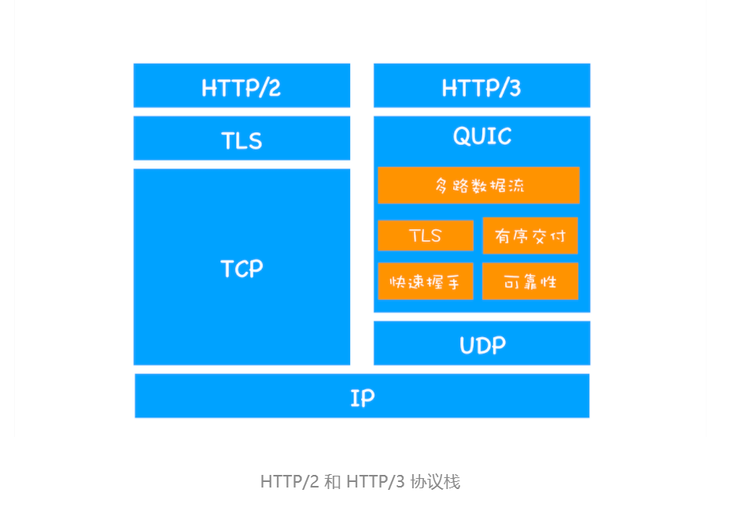

# HTTP 发展史

HTTP 协议在我们的生活中随处可见，打开手机或者电脑，只要你上网，不论是用 iPhone、Android、 Windows 还是 Mac，不论是用浏览器还是 App，不论是看新闻、短视频还是听音乐、玩游戏，后面总会有 HTTP 在默默为你服务。

## 史前时期

2020 世纪 60 年代，美国国防部高等研究计划署（ARPA）建立了 ARPA 网，它有四个分布在各地的节点，被认为 是如今互联网的“始祖”。
然后在 70 年代，基于对 ARPA 网的实践和思考，研究人员发明出了著名的 TCP/IP 协议。由于具有良好的分层 结构和稳定的性能，TCP/IP 协议迅速战胜其他竞争对手流行起来，并在 80 年代中期进入了 UNIX 系统内核， 促使更多的计算机接入了互联网。

## 创世纪

**蒂姆·伯纳斯-李（Tim Berners-Lee）** 在 1989 年发表了一个论文,确立了三项关键技术。

- URI：即统一资源标识符，作为互联网上资源的唯一身份；
- HTML：即超文本标记语言，描述超文本文档；
- HTTP：即超文本传输协议，用来传输超文本。

基于他们，就可以把 `超文本` 系统完美的运行在互联网上,这个系统被称之为 **“万维网”（World Wide Web）**

## HTTP/0.9

只有 `GET` 请求获取 HTML 文档，并且在响应请求之后立即关闭连接。

HTTP/0.9 虽然很简单，但它作为一个“原型”，充分验证了 Web 服务的可行性，而“简单”也正是它的优点，蕴含了进化和扩展的可能性，因为：
**“把简单的系统变复杂”，要比“把复杂的系统变简单”容易得多。**

## HTTP/1.0

因为多媒体技术( `JPEG`、 `MP3` 等相继发明)的发展,网名推动 HTTP 快速发展，并在 1996 年正式发布了 `HTTP/1.0` 。

- 增加了 HEAD、POST 等新方法；
- 增加了响应状态码，标记可能的错误原因；
- 引入了协议版本号概念；
- 引入了 HTTP Header（头部）的概念，让 HTTP 处理请求和响应更加灵活；
- 传输的数据不再仅限于文本。

但 **HTTP/1.0 并不是一个“标准”**，只是记录已有实践和模式的一份参考文档，不具有实际的约束力，相当于 一个“备忘录”。

## HTTP/1.1

浏览器大战之后，HTTP 协议成为一个“正式的标准”，而不是一份可有可无的“参考文档”,少了很多学术气息，更加接地气了。

HTTP/1.1 主要的变更点有：

- 增加了 `PUT`、 `DELETE` 等方法
- 允许数据分块（chunked）,支持大文件的上传
- 强制要求 HOST 头，让互联网主机托管成为了可能
- 增加了缓存管理
- 明确了连接管理，支持长连接(connection:keep-alive)
- 引入了客户端 Cookie、安全机制

这次标准的确定，成为了我们日常使用的 HTTP。

#### 主要问题

HTTP/1.1**对带宽的利用率却并不理想**

##### TCP的慢启动

一旦一个 TCP 连接建立之后，就进入了发送数据状态，刚开始 TCP 协议会采用一个非常慢的速度去发送数据，然后慢慢加快发送数据的速度，直到发送数据的速度达到一个理想状态，我们把这个过程称为慢启动。

##### **同时开启了多条 TCP 连接，那么这些连接会竞争固定的带宽。**

在下载过程中，当发现带宽不足的时候，各个 TCP 连接就需要动态减慢接收数据的速度。这样就会阻塞关键资源的下载

##### **队头阻塞的问题。**

HTTP/1.1 中使用持久连接时，虽然能**公用一个 TCP 管道**，但是在一个管道中同一时刻只能处理一个请求，在当前的请求没有结束之前，其他的请求只能处于阻塞状态。这意味着我们不能随意在一个管道中发送请求和接收内容。

## HTTPS

HTTPS 是为了解决 HTTP 安全问题的一个新协议，由“**HTTP over HTTP** ”变成了“ **HTTP over SSL/TLS**”，让 HTTP 运行在了安全的 SSL/TLS 协议上， 收发报文不再使用 Socket API，而是调用专门的安全接口。

## HTTP/2

HTTP 成为标准后，一家独大了十多年。直至 Chrome 开发出自己的浏览器，推出新的 `SPDY协议` 并应用在自己的浏览器上。这倒逼 HTTP 以 `SPDY协议` 为基础推出 HTTP 2 。

在性能改善上做出了很多努力：

- 变成二进制协议。
- 废弃 1.1 中的管道，引入了**二进制分帧层**,实现了多路复用,解决了队头堵塞问题

HTTP/2 使用了多路复用技术，可以将请求分成一帧一帧的数据去传输，这样带来了一个额外的好处，就是当收到一个优先级高的请求时，比如接收到 JavaScript 或者 CSS 关键资源的请求，服务器可以暂停之前的请求来优先处理关键资源的请求。

- 使用头部压缩算法，减少数据传输量（开发了“HPACK”算法，在客户端和服务器建立“字典”，用索引号表示重复的字符串，还采用哈夫曼编码来压缩整数和字符串，可以达到 **50%~90%** 的⾼压缩率。 ）
- 设置请求的优先级
- 增强了安全性（为了区分“加密”和“明⽂”这两个不同的版本，HTTP/2 协议定义了两个字符串标识符：“h2”表⽰加密 的 HTTP/2，“h2c”表⽰明⽂的 HTTP/2，多出的那个字⺟“c”的意思是“clear text”）

## HTTP/3

HTTP/2 只解决了应用层的队头堵塞问题，但 TCP 协议仍然会有**因为包丢失而造成的堵塞**。随着丢包率的增加，HTTP/2 的传输效率也会越来越差。有测试数据表明，当系统达到了 2% 的丢包率时，HTTP/1.1 的传输效率反而比 HTTP/2 表现得更好。

### 为什么不升级TCP

- **中间设备的僵化**

中间设备有很多种类型，并且每种设备都有自己的目的，这些设备包括了路由器、防火墙、NAT、交换机等。它们通常依赖一些很少升级的软件，这些软件使用了大量的 TCP 特性，这些功能被设置之后就很少更新了。

- **操作系统**

TCP 协议都是通过操作系统内核来实现的，应用程序只能使用不能修改。通常操作系统的更新都滞后于软件的更新，因此要想自由地更新内核中的 TCP 协议也是非常困难的。

所以 Chrome 决定革自己的命，使用 `UDP` 协议。 `UDP` 是⼀个简单、不可靠的传输协议，但是正是因为它简单，不需要建连和断连，通信成本低，也就⾮常灵活、⾼效，“可塑性”很强。 所以，**QUIC** 就选定了 `UDP` ，在它之上把 TCP 的那⼀套连接管理、拥塞窗⼝、流量控制等“搬”了过 来，“去其糟粕，取其精华”，打造出了⼀个全新的可靠传输协议，可以认为是“**新时代的 TCP**”。

- **实现了类似 TCP 的流量控制、传输可靠性的功能**。虽然 UDP 不提供可靠性的传输，但 QUIC 在 UDP 的基础之上增加了一层来保证数据可靠性传输。它提供了数据包重传、拥塞控制以及其他一些 TCP 中存在的特性。
- **集成了 TLS 加密功能**。目前 QUIC 使用的是 TLS1.3，相较于早期版本 TLS1.3 有更多的优点，其中最重要的一点是减少了握手所花费的 RTT 个数。
- **实现了 HTTP/2 中的多路复用功能**。和 TCP 不同，QUIC 实现了在同一物理连接上可以有多个独立的逻辑数据流
- **实现了快速握手功能。**由于 QUIC 是基于 UDP 的，所以 QUIC 可以实现使用 0-RTT 或者 1-RTT 来建立连接

---

参考资料

[《透视 HTTP 协议》](https://time.geekbang.org/column/intro/100029001)

[《HTTP 世界观》](https://mp.weixin.qq.com/s?__biz=MzAxOTAzNjUwMg==&mid=2448541703&idx=1&sn=164f1fb3e503f2e50ca6f5a97a7f119c&chksm=8fc8483eb8bfc1288b14aed0739425c2b31ce8e679a81ab0ffd8f1690c35c3032e0ecea73ab6&scene=126&sessionid=1589430279&key=ad1327b1c72241bf0ec91b57b52b52d6ead79c4dec3bb5ea1b9cf66dca50c9c27f5ddbfa2322fa04e2d68709954e2bb3e18c1af617ff2ac527a5ef9ebd9cac0d5ef977ef159d3959fa5954a561640d1c&ascene=1&uin=MTIwOTc2NTAyMQ%3D%3D&devicetype=Windows+10+x64&version=62090070&lang=zh_CN&exportkey=ATCMwpFbvaf56KD%2BcqI7xHA%3D&pass_ticket=DXKQiIl5eK%2BQt%2FmJHshlzwb8%2FTplkfJw6KRjxgfWB401dxQScVrscRWHXWr5DgV2)
