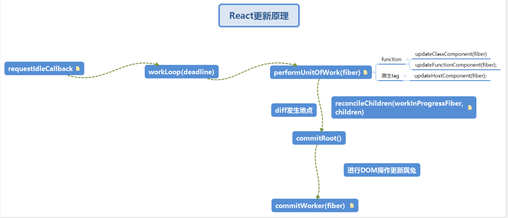
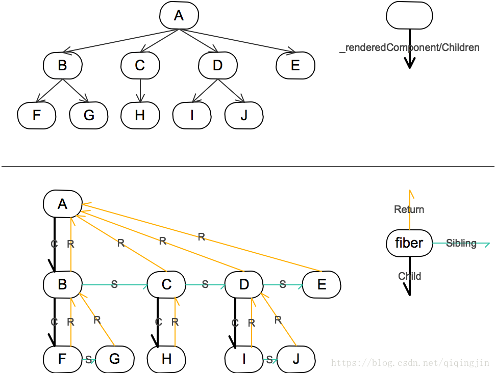

# React更新策略

先对整体流程梳理一下，然后再进行详细分解




### window.requestIdleCallback()

首先，React 通过使用了 window一个新的API 使任务队列可以在空闲时间进行视图更新，所以我们先来了解下一这个API。

**`window.requestIdleCallback()`**方法将在浏览器的空闲时段内调用的函数排队。这使开发者能够在主事件循环上执行后台和低优先级工作，而不会影响延迟关键事件，如动画和输入响应。函数一般会按先进先调用的顺序执行，然而，如果回调函数指定了执行超时时间`timeout`，则有可能为了在超时前执行函数而打乱执行顺序。

你可以在空闲回调函数中调用 **`requestIdleCallback()`**，以便在下一次通过事件循环之前调度另一个回调。

```js
var handle = window.requestIdleCallback(callback[, options])
```


react主要把到期时间分为两种：**异步任务到期时间**与**交互动作的到期时间**。在这之前需要了解一下一些重要的函数，react的到期时间与系统的时间ms不是1：1的关系，低优先级异步任务的两个时间间隔相差不到250ms（相当于25个单位的` 到期时间`）的任务会被设置为同一个到期时间，交互 异步任务间隔为100ms（10个单位到期时间），因此减少了一些不必要的组件渲染，并且保证交互可以及时的响应。


这里涉及一个时间计算公式

`src\react\packages\react-reconciler\src\ReactFiberExpirationTime.old.js`

```js
//整型最大数值，是V8中针对32位系统所设置的最大值
export const MAX_SIGNED_31_BIT_INT = 1073741823;
//1073741822
export const Sync = MAX_SIGNED_31_BIT_INT;
export const Batched = Sync - 1;

const UNIT_SIZE = 10;
//1073741821
const MAGIC_NUMBER_OFFSET = Batched - 1;

function ceiling(num: number, precision: number): number {
  return (((num / precision) | 0) + 1) * precision;
}

function computeExpirationBucket(
  currentTime,
  expirationInMs,
  bucketSizeMs,
): ExpirationTime {
  return (
    MAGIC_NUMBER_OFFSET -
    ceiling(
      MAGIC_NUMBER_OFFSET - currentTime + expirationInMs / UNIT_SIZE,
      bucketSizeMs / UNIT_SIZE,
    )
  );
}
```


#### 低优先级

```js
export const LOW_PRIORITY_EXPIRATION = 5000;
export const LOW_PRIORITY_BATCH_SIZE = 250;
```

#### 高优先级

```js
export const HIGH_PRIORITY_EXPIRATION = __DEV__ ? 500 : 150;
export const HIGH_PRIORITY_BATCH_SIZE = 100;
```


react低优先级update的expirationTime间隔是**25ms**，(同理高优先级的间隔为**10ms**) react让两个相近（25ms内）的update得到相同的expirationTime，目的就是让这两个update自动合并成一个Update，从而达到批量更新的目的，就像LOW_PRIORITY_BATCH_SIZE的名字一样，自动合并批量更新。


#### 优先级怎么来

`  \react\packages\react-reconciler\src\ReactFiberWorkLoop.old.js`

```js
//为fiber对象计算expirationTime
export function computeExpirationForFiber(
  currentTime: ExpirationTime,
  fiber: Fiber,
  suspenseConfig: null | SuspenseConfig,
): ExpirationTime {
  ...
  // Compute an expiration time based on the Scheduler priority.
    switch (priorityLevel) {
      case ImmediatePriority:
        expirationTime = Sync;
        break;
      case UserBlockingPriority:
        // TODO: Rename this to computeUserBlockingExpiration
        // 高优先级
        expirationTime = computeInteractiveExpiration(currentTime);
        break;
      case NormalPriority:
      case LowPriority: // TODO: Handle LowPriority
        // 低优先级执行函数
        expirationTime = computeAsyncExpiration(currentTime);
        break;
      case IdlePriority:
        expirationTime = Never;
        break;
      default:
        invariant(false, 'Expected a valid priority level');
    }
  ...
}
```


fiber的expirationTime又来自priorityLevel，

priorityLevel则来自用户的UI操作，不同的事件，带来三种不同的priorityLevel。

- DiscreteEvent 离散事件. 例如blur、focus、 click、 submit、 touchStart. 这些事件都是离散触发的。  => **NormalPriority**
- UserBlockingEvent 用户阻塞事件. 例如touchMove、mouseMove、scroll、drag、dragOver等等。这些事件会'阻塞'用户的交互。=> **UserBlockingPriority**
- ContinuousEvent 连续事件。例如load、error、loadStart、abort、animationEnd. 这个优先级最高，也就是说它们应该是立即同步执行的，这就是Continuous的意义，是持续地执行，不能被打断。 => **ImmediatePriority**

而悬停，则只为某个fiber带来第四种priorityLevel——**LowPriority。**

用户代码出现问题，被catch住时，出现第五种priorityLevel——**IdlePriority。*


注：箭头后面是推测 还没有找到根据


### workLoop

不断检查主线程是否有空闲，并开始下个任务的构建执行，然后进行提交 更新DOM

```js
function workLoop(deadline) {
  // deadline.timeRemaining() > 1 是暂时写死的，详细的空闲情况参照上面的 ExpirationTime 分析
  // !shouldYield()
  while (nextUnitOfWork && deadline.timeRemaining() > 1) {
    // 执行下一个任务
    nextUnitOfWork = performUnitOfWork(nextUnitOfWork);
  }

  if (!nextUnitOfWork && wipRoot) {
    commitRoot();
  }
  requestIdleCallback(workLoop);
}
```


进行递归fiber协调，更新fiber结构

```js
function performUnitOfWork(fiber) {
  // 1.执行当前任务
  const {type} = fiber;
  if (typeof type === "function") {
    // todo
    type.isReactComponent
      ? updateClassComponent(fiber)
      : updateFunctionComponent(fiber);
  } else {
    // h5标签
    updateHostComponent(fiber);
  }

  // 2. 返回下一个任务
  // 返回下一个任务原则： 1). 有子元素返回子元素
  if (fiber.child) {
    return fiber.child;
  }
  // 2) 如果没有子元素，找兄弟元素
  let nextFiber = fiber;
  while (nextFiber) {
    if (nextFiber.sibling) {
      return nextFiber.sibling;
    }
    nextFiber = nextFiber.return;
  }
}
```

对不同形式的组件分别处理，以下是类组件协调代码，核心是 **reconcileChildren**

```js
function updateClassComponent(fiber) {
  const {type, props} = fiber;
  let cmp = new type(props);
  let vvnode = cmp.render();
  const children = [vvnode];
  reconcileChildren(fiber, children);
}
```


协调Fiber，首先要明白Fiber是一个React自己创造的数据结构

#### Fiber

```js
/**
 * fiber架构
 * type: 标记类型
 * key: 标记当前层级下的唯一性
 * child : 第一个子元素 fiber
 * sibling ： 下一个兄弟元素 fiber
 * return： 父fiber
 * node： 真实dom节点
 * props：属性值
 * base: 上次的节点 fiber
 * effectTag: 标记要执行的操作类型（删除、插入、更新）
 */
```

除了一些继承下来的属性，讲几个关键点

sibling ： 下一个兄弟元素 fiber，类似于链表结构，按同级元素一个链接一个，实现同级元素的快速插入、删除

child :第一个子元素的fiber，支持向下递归

return： 父fiber，




类似于这也一个个小的Fiber，相互链接构成了一棵完整的fiber Tree


#### **reconcileChildren**

// TODO:

**reconcileChildren** 也叫协调，对比每个层级fiber内容，为fiber打上effectTag记号：

- UPDATE
- DELETION
- PLACEMENT

然后等待提交后，进行对应的DOM操作

#### UPDATE


### 总结

Fiber 在我眼里是一种协调diff比对的一个调度算法，他通过 requestIdleCallback 来获取主线程的空闲时间来进行 diif比对整个fiber Tree，因为他是链表结构，所以可以在线程无空闲时间，将节点暂停等待下次空闲时间继续进行，直到更新到rootWip，再commitRoot进行更新DOM节点。另外 他在空闲时间计算上引入了 优先级策略，使得高优先级的任务可以插队进行，一些异步任务可以延迟或者被打断，实现高效的页面更新。

