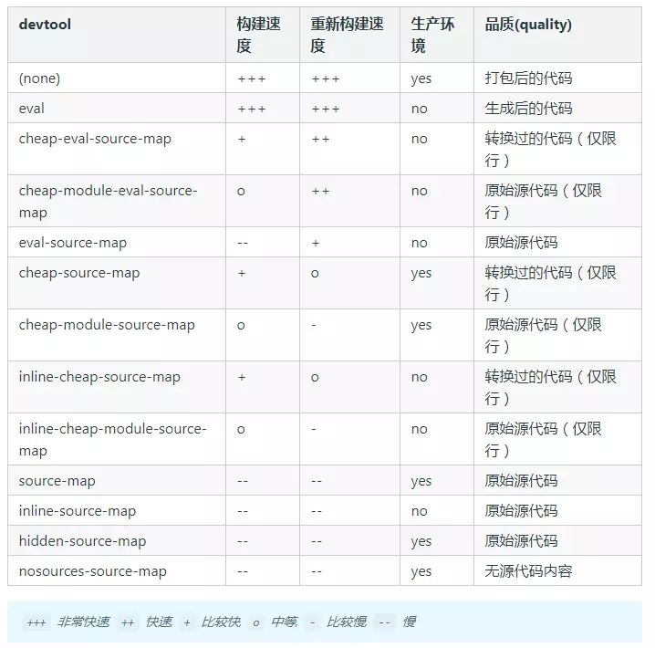

# webpack

## 基础概念

**webpack_require**

webpack_exports

### hash chunkhash contenthash 区别

- hash 代码发生改变 hash 就会改变

- contenthash 自身内容发生改变 才会改变

- chunkhash 同一个 chunk 有发生改变，都会改变

### bundle、module、chunk 的区别

- bundle：一个入口文件打包后的文件，

- 每一个文件都是一个 module

- bundle 里的 eval 都是一个 chunk，

### loader

loader 用于对模块的源代码进行转换。loader 可以使你在 `import` 或"加载"模块时预处理文件

#### 使用

举一个 less-loader 使用例子

```js
 rules: [
      {
        test: /\.less$/, //  匹配规则
        // use可对象，可以<string,object>数组
        //使用对象时，可通过options传参,通过this.query获取
        use: ["my-style-loader", "my-css-loader", {
          loader: "my-less-loader",
          options: {
            name: "scssloader",
          },
        }], //多个loader从右向左
      },
    ],
```

#### 自定义 loader

```js
// 函数 声明式函数 不可以是箭头函数
// 函数 必须有返回值
// 如何返回多值
// 如何处理异步逻辑
module.exports = function(source) {
  console.log(this.query);
  console.log(source);
  // 异步回调
  const callback = this.async();
  setTimeout(() => {
    const result = source.replace("webpack", this.query.name);
    callback(null, result);
  }, 2000);
  //  同步回调
  //   this.callback(null, result);
};
//this.callback(  err: Error | null,  content: string | Buffer,  sourceMap?: SourceMap,  meta?: any );
```

#### 重命名自定义 loader

```js
 resolveLoader: {
    modules: ["./node_modules", "./myLoaders"],
  },
```

#### 常用 loader

### plugins

插件是 webpack 的[支柱](https://github.com/webpack/tapable)功能。webpack 自身也是构建于，你在 webpack 配置中用到的**相同的插件系统**之上！

插件目的在于解决 [loader](https://www.webpackjs.com/concepts/loaders) 无法实现的**其他事**。

#### 使用

使用相当简单，具体传入参数看文档就好

```js
const HtmlWebpakcPlugin = require("html-webpack-plugin");

plugins: [new HtmlWebpakcPlugin(), new CleanWebpackPlugin(), new fileWebpackPlugin()],
```

#### 自定义 Plugins

```js
class fileWebpackPlugin {
  //   constructor(options) {
  //     console.log(options);
  //   }
  //如何钩入hooks
  apply(compiler) {
    compiler.hooks.emit.tapAsync("fileWebpackPlugin", (compilation, cb) => {
      const len = Object.keys(compilation.assets).length;
      let content = `文件的数量：${len}`;
      for (let filename in compilation.assets) {
        content += `\n ${filename}`;
      }
      compilation.assets[`file.txt`] = {
        source: function() {
          return content;
        },
        size: function() {
          return 1024;
        },
      };
      cb();
    });
  }
}
module.exports = fileWebpackPlugin;
```

在插件开发中最重要的两个资源就是 `compiler` 和 `compilation` 对象。理解它们的角色是扩展 webpack 引擎重要的第一步。

- `compiler` 对象代表了**完整的 webpack 环境配置**。这个对象在启动 webpack 时被一次性建立，并配置好所有可操作的设置，包括 options，loader 和 plugin。当在 webpack 环境中应用一个插件时，插件将收到此 compiler 对象的引用。可以使用它来访问 webpack 的主环境。
- `compilation` 对象代表了一次资源版本构建。当运行 webpack 开发环境中间件时，每当检测到一个文件变化，就会创建一个新的 compilation，从而生成一组**新的编译资源**。一个 compilation 对象表现了当前的模块资源、编译生成资源、变化的文件、以及被跟踪依赖的状态信息。compilation 对象也提供了很多关键时机的回调，以供插件做自定义处理时选择使用。

#### 查看配置的 webpack 周期

```js
const compiler = webpack(config);
Object.keys(compiler.hooks).forEach((hookName) => {
  compiler.hooks[hookName].tap("xxxx", () => {
    console.log(`run====> ${hookName}`);
  });
});

compiler.run();
```

### sourceMap

- eval:速度最快，使用 eval 包裹代码
- source-map：产生`.map`文件，外部产生错误代码的位置和信息
- cheap：较快，不包含列信息
- Module：第三方模块，包含 loader 的 sourceMap// 无论是 JSX 还是 vue 单文件组件，Loader 转换后差别都很大，需要调试 Loader 转换前的源代码。
- inline：将`.map`文件作为 dateURI 嵌入，不单独生成

_验证 devtool 名称时， 我们期望使用某种模式， 注意不要混淆 devtool 字符串的顺序， 模式是：_ `[inline-|hidden-|eval-][nosources-][cheap-[module-]]source-map`_._



#### 特殊模式

- inline-source-map 模式
  它跟普通的 source-map 效果相同，只不过这种模式下 Source Map 文件不是以物理文件存在，而是以 data URLs 的方式出现在代码中。我们前面遇到的 eval-source-map 也是这种 inline 的方式。

- hidden-source-map 模式
  在这个模式下，我们在开发工具中看不到 Source Map 的效果，但是它也确实生成了 Source Map 文件，这就跟 jQuery 一样，虽然生成了 Source Map 文件，但是代码中并没有引用对应的 Source Map 文件，开发者可以自己选择使用。

- nosources-source-map 模式：
  在这个模式下，我们能看到错误出现的位置（包含行列位置），但是点进去却看不到源代码。这是为了保护源代码在生产环境中不暴露。

#### 推荐配置

vuecli production 采用 source-map

个人理解 production 应该使用 none 或者 nosources-source-map

development 采用 cheap-module-eval-source-map

### 热更新

#### 开启

```js
  devServer: {
    // 开启 HMR 特性，如果资源不支持 HMR 会 fallback 到 live reloading
    hot: true
    // 只使用 HMR，不会 fallback 到 live reloading
    // hotOnly: true
  },
  plugins: [
    // ...
    // HMR 特性所需要的插件
    new webpack.HotModuleReplacementPlugin()
  ]
```

#### 原理

启动一个 websocket 监听文件 id 变化，执行除以 js，并重新执行

```js
if (module.hot) {
  module.hot.accept("./number", function() {
    document.body.removeChild(document.getElementById("number"));
    number();
  });
}
```

热更新插件也就是通过对每个文件进行监听

#### 常见问题

##### 运行时错误

如果处理热替换的代码（处理函数）中有错误，结果也会导致自动刷新。导致无法看到错误日志，

解决办法：开启 hotonly

##### 未开启 HMR

```js
if (module.hot) {
  // 确保有 HMR API 对象
  module.hot.accept("./editor", () => {
    // ...
  });
}
```

### babel

#### 预设

1.babel-loader 是 webpack 与 babel 的通信桥梁，不会做把 es6 转成 es5 的⼯作，这部分⼯作需要⽤到 **@babel/preset-env**来做 2.@babel/preset-env ⾥包含了 es，6，7，8 转 es5 的转换规则

#### polyfill

默认的 Babel 只⽀持 let 等⼀些基础的特性转换，Promise 等⼀些还有转换过 来，这时候需要借助@babel/polyfill，把 es 的新特性都装进来，来弥补低版本浏览器中缺失的特性

```js
//index.js 顶部
import "@babel/polyfill";
```

#### 按需加载

```js
//.babelrc
{
  "presets": [
    [
      "@babel/preset-env",
      {
        "targets": {
          //目标环境
          "edge": "17",
          "firefox": "60",
          "chrome": "67",
          "safari": "11"
        },
        "corejs": 2,//新版本需要指定核⼼库版本
        "useBuiltIns": "usage"
      }
    ],
    "@babel/preset-react"
  ]
}

```

useBuiltIns 选项是 babel 7 的新功能，这个选项告诉 babel 如何配置 @babel/polyfill 。 它有三 个参数可以使⽤：

①entry: 需要在 webpack 的⼊⼝⽂件⾥ import "@babel/polyfill" ⼀ 次。 babel 会根据你的使⽤情况导⼊垫⽚，没有使⽤的功能不会被导⼊相应的垫⽚。

②usage: 不需要 import ，全⾃动检测，但是要安装 @babel/polyfill 。（试验阶段）

③false: 如果你 import "@babel/polyfill" ，它不会排除掉没有使⽤的垫⽚，程序体积会庞⼤。(不推荐)

## tree-shaking

webpack4 的 production 默认开启了 treeshaking

如果是 webpack2 ，可能会不起作用，因为 babel 会将代码转化成 commonjs 模块，而 treeshaking 不支持

```
options:{presets:[["es2015",{module:false}]]}
```

### 使用

```js
// ./webpack.config.js
module.exports = {
  // ... 其他配置项
  optimization: {
    // 模块只导出被使用的成员
    usedExports: true,
    // 尽可能合并每一个模块到一个函数中
    concatenateModules: true,
    // 压缩输出结果
    minimize: false,
  },
};
```

### 副作用 side effects

side effects 是指那些当 import 的时候会执行一些动作，但是不一定会有任何 export。比如 ployfill

tree-shaking 不能自动的识别那些代码属于 side effcets 所以，有些需要手动指定

```json
## pagejson
{
    name:'tree-shaking',
    "sideEffects":false,
    // sideEffects:[
    // './src/common/ployfill.js'
    // ]
}
```

## rollup

Rollup 诞生的目的并不是要与 Webpack 这样的工具全面竞争。它的初衷只是希望能够**提供一个高效的 ES Modules 打包器，充分利用 ES Modules 的各项特性，构建出结构扁平，性能出众的类库**。

Rollup 打包结果惊人的简洁，基本上就跟我们手写的代码一样。相比于 Webpack 大量的引导代码和一堆的模块函数，这里的输出结果没有任何多余代码，就是把打包过程中的各个模块按照依赖顺序，先后拼接到了一起。

### 输出格式

```js
// ./rollup.config.js
// 所有 Rollup 支持的格式
const formats = ["es", "amd", "cjs", "iife", "umd", "system"];
export default formats.map((format) => ({
  input: "src/index.js",
  output: {
    file: `dist/bundle.${format}.js`,
    format,
  },
}));
```

### 使用插件

```js
// ./rollup.config.js
import json from "@rollup/plugin-json";
export default {
  input: "src/index.js",
  output: {
    file: "dist/bundle.js",
    format: "es",
  },
  plugins: [json()],
};
```

### 加载 NPM 模块

Rollup 默认只能够按照文件路径的方式加载本地的模块文件，对于 node_modules 目录中的第三方模块，并不能像 Webpack 一样，直接通过模块名称直接导入。

```js
import resolve from '@rollup/plugin-node-resolve'
export default {
  ...
  plugins: [
    resolve()
  ]
}
```

### 加载 CommonJS 模块

由于 Rollup 设计的是只处理 ES Modules 模块的打包，所以如果在代码中导入 CommonJS 模块，默认是不被支持的

```js
import commonjs from '@rollup/plugin-commonjs'
export default {
  ...
  plugins: [
    commonjs()
  ]
}
```

### 优缺点

优点

- 输出结果更加扁平，执行效率更高；
- 自动移除未引用代码；
- 打包结果依然完全可读。

但是它的缺点也同样明显：

- 加载非 ESM 的第三方模块比较复杂；
- 因为模块最终都被打包到全局中，所以无法实现 HMR；
- 浏览器环境中，代码拆分功能必须使用 Require.js 这样的 AMD 库。

总结一下：Webpack 大而全，Rollup 小而美。
