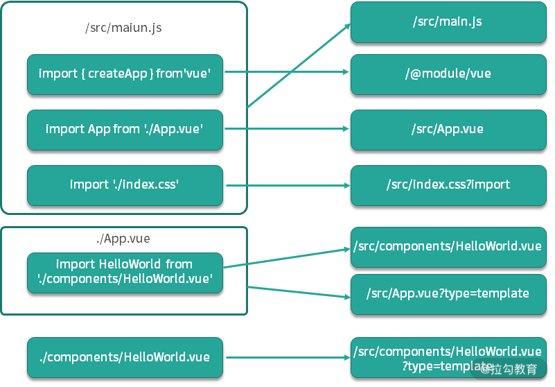

# Webpack 优化

## 编译阶段优化

### 分析准备

#### 速度分析

```js
const SpeedMeasurePlugin = require("speed-measure-webpack-plugin");
const smp = new SpeedMeasurePlugin();

let webpackProdOut = webpackMerge(webpackBase, webpackProd);
if (process.env.SMP_OPEN) {
  webpackProdOut = smp.wrap(webpackProdOut);
}
```

检查那个插件或者 loader 时间过长，可以配合缓存进行优化

```cmd
 SMP  ⏱
General output time took 1.52 secs

 SMP  ⏱  Plugins
TerserPlugin took 0.269 secs
HtmlWebpackPlugin took 0.161 secs
UglifyJsPlugin took 0.141 secs
Object took 0.03 secs
CompressionPlugin took 0.021 secs
OptimizeCssAssetsWebpackPlugin took 0.002 secs
MiniCssExtractPlugin took 0.001 secs
HashedModuleIdsPlugin took 0 secs

 SMP  ⏱  Loaders
babel-loader took 0.746 secs
  module count = 2
html-webpack-plugin took 0.021 secs
  module count = 2
```

#### 体积分析

```js
const BundleAnalyzerPlugin = require("webpack-bundle-analyzer")
  .BundleAnalyzerPlugin;

if (WATCH_ANALYZER) {
  plugins.push(new BundleAnalyzerPlugin());
}
```

就会生成一个可视化的体积页面，进行分析优化，将大包进行分包，不常更新的包进行 CDN 引入，或者打成 DLL 包

### 并行构建以提升总体效率

随着目前最新稳定版本 Webpack 4 的发布，人们发现在一般项目的开发阶段和小型项目的各构建流程中已经用不到这种并发的思路了，因为在这些情况下，并发所需要的多进程管理与通信所带来的额外时间成本可能会超过使用工具带来的收益。

#### HappyPack(不维护了)、thread-loader

`thread-loader` 会将你的 `loader` 放置在一个 `worker` 池里面运行，以达到多线程构建。

```js
rules: [
  {
    test: /\.js$/,
    include: path.resolve("src"),
    use: [
      "thread-loader",
      // your expensive loader (e.g babel-loader)
    ],
  },
];
```

#### parallel-webpack

针对与多配置构建。Webpack 的配置文件可以是一个包含多个子配置对象的数组，在执行这类多配置构建时，默认串行执行，而通过 parallel-webpack，就能实现相关配置的并行处理。

### 生产环境关闭 sourcemap

### Externals

与 CDN 配合将大型的库或者框架从打包中移除，使用 CDN

### DLL 打包

在使用`webpack`进行打包时候，对于依赖的第三方库，比如`vue`，`vuex`等这些不会修改的依赖，我们可以让它和我们自己编写的代码分开打包，这样做的好处是每次更改我本地代码的文件的时候，`webpack`只需要打包我项目本身的文件代码，而不会再去编译第三方库。

那么第三方库在第一次打包的时候只打包一次，以后只要我们不升级第三方包的时候，那么`webpack`就不会对这些库去打包，这样的可以快速的提高打包的速度。其实也就是`预编译资源模块`。

#### DllPlugin

`DLLPlugin` 插件是在一个额外独立的`webpack`设置中创建一个只有`dll`的`bundle`，也就是说我们在项目根目录下除了有`webpack.config.js`，还会新建一个`webpack.dll.js`文件。

`webpack.dll.js`的作用是把所有的第三方库依赖打包到一个`bundle`的`dll`文件里面，还会生成一个名为 `manifest.json`文件。该`manifest.json`的作用是用来让 `DllReferencePlugin` 映射到相关的依赖上去的。

#### DllReferencePlugin

这个插件是在`webpack.config.js`中使用的，该插件的作用是把刚刚在`webpack.dll.js`中打包生成的`dll`文件引用到需要的预编译的依赖上来。

`vendor-manifest.json`文件就是一个第三方库的映射而已。

```js
//* webpack.dll.js

const path = require("path");
const webpack = require("webpack");
module.exports = {
  mode: "production",
  entry: {
    vendors: ["lodash"],
  },
  output: {
    filename: "[name].dll.js",
    path: path.resolve(__dirname, "../dll"),
    library: "[name]",
  },
  plugins: [
    new webpack.DllPlugin({
      name: "[name]",
      path: path.resolve(__dirname, "../dll/[name].manifest.json"),
    }),
  ],
};
```

```js
// webpack.config.base.js
const AddAssetHtmlWebpackPlugin = require('add-asset-html-webpack-plugin')
const webpack = require('webpack')

const files = fs.readdirSync(path.resolve(__dirname, "../dll"));
files.forEach((file) => {
  if (/.*\.dll.js/.test(file)) {
    plugins.push(
      new AddAssetHtmlWebpackPlugin({
        filepath: path.resolve(__dirname, "../dll", file),
      })
    );
  }
  if (/.*\.manifest.json/.test(file)) {
    plugins.push(
      new webpack.DllReferencePlugin({
        manifest: path.resolve(__dirname, "../dll", file),
      })
    );
  }
});
```

### IgnorePlugin

有的依赖包，除了项目所需的模块内容外，还会附带一些多余的模块。典型的例子是 moment 这个包，一般情况下在构建时会自动引入其 locale 目录下的多国语言包，

```js
    new webpack.IgnorePlugin({
      resourceRegExp: /^\.\/locale$/,
      contextRegExp: /moment$/,
    }),
```

### include/exclude

include 的用途是只对符合条件的模块使用指定 Loader 进行转换处理。而 exclude 则相反，不对特定条件的模块使用该 Loader（例如不使用 babel-loader 处理 node_modules 中的模块）。

```js
rules: [
      {
        test: /\.js$/,
        include: /src|jquery/, //这里的include jquery将不生效，因为exclude优先级更高
        exclude: /node_modules/,
        use: ['babel-loader'],
      },
    ],
```

## 打包阶段优化

### SpiltChunks

Split Chunks 有诸多优点，例如有利于缓存命中、有利于运行时的持久化文件缓存等。其中有一类情况能提升后续环节的工作效率，即通过分包来抽离多个入口点引用的公共依赖。

大模块不提取，重复打包，影响较大

```js
optimization: {
  splitChunks: {
    // 自动提取所有公共模块到单独 bundle
    chunks: "all";
  }
}
```

除此之外，splitChunks 还支持很多高级的用法，可以实现各种各样的分包策略，这些我们可以在 [文档](https://webpack.js.org/plugins/split-chunks-plugin/) 中找到对应的介绍。

### 代码压缩

webpack4 已经默认支持 ES6 语法的压缩。所以不用 uglyjs 该用 webpack 官方的 terser-webpack-plugin

```js
// ./webpack.config.js
const MiniCssExtractPlugin = require("mini-css-extract-plugin");
const OptimizeCssAssetsWebpackPlugin = require("optimize-css-assets-webpack-plugin");
const TerserWebpackPlugin = require("terser-webpack-plugin");
module.exports = {
  mode: "none",
  entry: {
    main: "./src/index.js",
  },
  output: {
    filename: "[name].bundle.js",
  },
  optimization: {
    minimizer: [
      new TerserWebpackPlugin(),
      new OptimizeCssAssetsWebpackPlugin(),
    ],
  },
  module: {
    rules: [
      {
        test: /\.css$/,
        use: [MiniCssExtractPlugin.loader, "css-loader"],
      },
    ],
  },
  plugins: [new MiniCssExtractPlugin()],
};
```

#### TerserWebpackPlugin 原理

Webpack 4 内置了压缩插件 TerserWebpackPlugin，且默认开启了缓存参数。在初次构建的压缩代码过程中，就将这一阶段的结果写入了缓存目录（node_modules/.cache/terser-webpack-plugin/）中，当再次构建进行到压缩代码阶段时，即可对比读取已有缓存，

```js
terser-webpack-plugin/src/index.js:
...
if (cache.isEnabled()) {
  let taskResult;
  try {
    taskResult = await cache.get(task); //读取缓存
  } catch (ignoreError) {
    return enqueue(task); //缓存未命中情况下执行任务
  }
  task.callback(taskResult); //缓存命中情况下返回缓存结果
  ...
  const enqueue = async (task) => {
    let taskResult;
    if (cache.isEnabled() && !taskResult.error) {
      await cache.store(task, taskResult); //写入缓存
    }
  }
}
```

### 利用缓存

#### babel-loader

```js
 {
    test: /\.js$/,
    exclude: /node_modules/,
    use: [{
      loader: "babel-loader",
      options: {
        cacheDirectory: true
      }
    }],
  },
```

#### cache-loader

```js
        use: [
          'cache-loader',
          ...loaders
        ],
```

请注意，保存和读取这些缓存文件会有一些时间开销，所以请只对性能开销较大的 `loader` 使用此 `loader`。可以结合 smp 分析

#### hard-source-webpack-plugin

```js
// webpack.config.js
var HardSourceWebpackPlugin = require('hard-source-webpack-plugin');

module.exports = {
  output: // ...
  plugins: [
    new HardSourceWebpackPlugin()
  ]
}
```

构建速度提升 50%以上 `webpack5`中会内置`hard-source-webpack-plugin`。

### 动态导入

require.ensure（vue-router 配置路由，使用 webpack 的 require.ensure 技术，也可以实现按需加载。）

#### vue 异步组件技术

```js
component: (resolve) => require(["../components/PromiseDemo"], resolve);
```

#### es 提案的 import()

```js
const Home = () =>
  import(/* webpackChunkName: 'ImportFuncDemo' */ "@/components/home");
```

##### 魔法注释

默认通过动态导入产生的 bundle 文件，它的 name 就是一个序号，这并没有什么不好，因为大多数时候，在生产环境中我们根本不用关心资源文件的名称。

但是如果你还是需要给这些 bundle 命名的话，就可以使用 Webpack 所特有的魔法注释去实现。

#### webpack

```js
component: (r) =>
  require.ensure([], () => r(require("@/components/home")), "demo");
```

## webpack5

### Persistent Cac·hing

实现了生产环境的增量更新

#### Cache 基本配置

在 Webpack 4 中，cache 只是单个属性 d 的配置，所对应的赋值为 true 或 false，用来代表是否启用缓存，或者赋值为对象来表示在构建中使用的缓存对象。而在 Webpack 5 中，cache 配置除了原本的 true 和 false 外，还增加了许多子配置项，例如：

- cache.**type**：缓存类型。值为 'memory'或‘filesystem’，分别代表基于内存的临时缓存，以及基于文件系统的持久化缓存。在选择 filesystem 的情况下，下面介绍的其他属性生效。
- cache.**cacheDirectory**：缓存目录。默认目录为 node_modules/.cache/webpack。
- cache.**name**：缓存名称。同时也是 cacheDirectory 中的子目录命名，默认值为 Webpack 的 ${config.name}-${config.mode}。
- cache.**cacheLocation**：缓存真正的存放地址。默认使用的是上述两个属性的组合：path.resolve(cache.cacheDirectory, cache.name)。该属性在赋值情况下将忽略上面的 cacheDirectory 和 name 属性。

#### 单个模块的缓存失效

Webpack 5 会跟踪每个模块的依赖项：fileDependencies、contextDependencies、missingDependencies。当模块本身或其依赖项发生变更时，Webpack 能找到所有受影响的模块，并重新进行构建处理。

这里需要注意的是，对于 node_modules 中的第三方依赖包中的模块，出于性能考虑，Webpack 不会跟踪具体模块文件的内容和修改时间，而是依据依赖包里 package.json 的 name 和 version 字段来判断模块是否发生变更。因此，单纯修改 node_modules 中的模块内容，在构建时不会触发缓存的失效。

#### 全局的缓存失效

当模块代码没有发生变化，但是构建处理过程本身发生变化时（例如升级了 Webpack 版本、修改了配置文件、改变了环境变量等），也可能对构建后的产物代码产生影响。因此在这种情况下不能复用之前缓存的数据，而需要让全局缓存失效，重新构建并生成新的缓存。在 Webpack 5 中共提供了 3 种不同维度的全局缓存失效配置。

##### buildDependencies

第一种配置是 cache.buildDependencies，用于指定可能对构建过程产生影响的依赖项。

它的默认选项是{defaultWebpack: ["webpack/lib"]}。这一选项的含义是，当 node_modules 中的 Webpack 或 Webpack 的依赖项（例如 watchpack 等）发生变化时，当前的构建缓存即失效。

上述选项是默认内置的，无须写在项目配置文件中。配置文件中的 buildDenpendencies 还支持增加另一种选项 {config: [__filename]}，它的作用是当配置文件内容或配置文件依赖的模块文件发生变化时，当前的构建缓存即失效。

##### version

第二种配置是 cache.version。当配置文件和代码都没有发生变化，但是构建的外部依赖（如环境变量）发生变化时，预期的构建产物代码也可能不同。这时就可以使用 version 配置来防止在外部依赖不同的情况下混用了相同的缓存。例如，可以传入 cache: {version: process.env.NODE_ENV}，达到当不同环境切换时彼此不共用缓存的效果。

##### name

缓存的名称除了作为默认的缓存目录下的子目录名称外，也起到区分缓存数据的作用。例如，可以传入 cache: {name: process.env.NODE_ENV}。这里有两点需要补充说明：

name 的特殊性：与 version 或 buildDependencies 等配置不同，name 在默认情况下是作为缓存的子目录名称存在的，因此可以利用 name 保留多套缓存。在 name 切换时，若已存在同名称的缓存，则可以复用之前的缓存。与之相比，当其他全局配置发生变化时，会直接将之前的缓存失效，即使切换回之前已缓存过的设置，也会当作无缓存处理。

当 cacheLocation 配置存在时，将忽略 name 的缓存目录功能，上述多套缓存复用的功能也将失效。

##### 其他

除了上述介绍的配置项外，cache 还支持其他属性：managedPath、hashAlgorithm、store、idleTimeout 等，具体功能可以通过官方文档进行查询。

此外，在 Webpack 4 中，部分插件是默认启用缓存功能的（例如压缩代码的 Terser 插件等），项目在生产环境下构建时，可能无意识地享受缓存带来的效率提升，但是在 Webpack 5 中则不行。无论是否设置 cache 配置，Webpack 5 都将忽略各插件的缓存设置（例如 TerserWebpackPlugin），而由引擎自身提供构建各环节的缓存读写逻辑。因此，项目在迁移到 Webpack 5 时都需要通过上面介绍的 cache 属性来单独配置缓存。

### Tree Shaking

Webpack 4 中的 Tree Shaking 功能在使用上存在限制：只支持 ES6 类型的模块代码分析，且需要相应的依赖包或需要函数声明为无副作用等。

#### Nested Tree Shaking

Webpack 5 增加了对嵌套模块的导出跟踪功能，能够找到那些嵌套在最内层而未被使用的模块属性。

#### Inner Module Tree Shaking

Webpack 5 中还增加了分析模块中导出项与导入项的依赖关系的功能。通过 optimization.innerGraph（生产环境下默认开启）选项，Webpack 5 可以分析特定类型导出项中对导入项的依赖关系，从而找到更多未被使用的导入模块并加以移除。

#### CommonJS Tree Shaking

Webpack 5 中增加了对一些 CommonJS 风格模块代码的静态分析功功能：

- 支持 exports.xxx、this.exports.xxx、module.exports.xxx 语法的导出分析。
- 支持 object.defineProperty(exports, "xxxx", ...) 语法的导出分析。
- 支持 require('xxxx').xxx 语法的导入分析。

### Logs

第三个要提到的 Webpack 5 的效率优化点是，它增加了许多内部处理过程的日志，可以通过 stats.logging 来访问。

### 更多

请查看[官方文档](https://github.com/webpack/changelog-v5)

## 无包构建

无包构建指的是：在构建时只需处理模块的编译而无须打包，把模块间的**依赖关系完全交给浏览器来处理。**浏览器会加载入口模块，分析依赖后，再通过网络请求加载被依赖的模块。通过这样的方式简化构建时的处理过程，提升构建效率。

### Vite



详细运行查看[Vite](./Vue_vite.md)

### Snowpack

Snowpack 是另一个比较知名的无包构建工具，从整体功能来说和上述 Vite 工具提供的功能大致相同，主要差异点在 Snowpack 在生产环境下默认使用无包构建而非打包模式（可以通过引入打包插件例如 @snowpack/plugin-webpack 来实现打包模式）

### 无包构建与打包构建

优点：

- 初次构建速度快
- 按需编译，在浏览器渲染时，根据入口模块分析加载所需模块，编译过程按需处理
- 增量构建速度快

缺点：

- 浏览器网络请求数量剧增，尤其对不支持的 HTTP2.0 的服务器
- 浏览器兼容性
