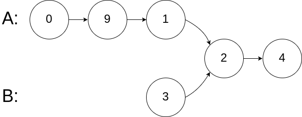
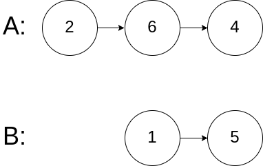

# 【基础篇 - Day 10】 2020-11-010 - 160 相交链表（02. 链表 ）

## 题目描述

> ## 入选理由
>
> 1. 考察链表中的进阶题型-相交链表
> 2. 考察大家能否在链表中灵活的使用双指针
>
> ## 题目描述
>
> 编写一个程序，找到两个单链表相交的起始节点。
>
> 如下面的两个链表：
>
> [](https://user-images.githubusercontent.com/38604634/98552943-08c0cc80-22da-11eb-8f51-7bd7a9f491f8.png)
>
> 在节点 c1 开始相交。
>
>  
>
> 示例 1：
> [](https://user-images.githubusercontent.com/38604634/98553017-1ece8d00-22da-11eb-9d29-587cbce1f414.png)
>
> 输入：intersectVal = 8, listA = [4,1,8,4,5], listB = [5,0,1,8,4,5], skipA = 2, skipB = 3
> 输出：Reference of the node with value = 8
> 输入解释：相交节点的值为 8 （注意，如果两个链表相交则不能为 0）。从各自的表头开始算起，链表 A 为 [4,1,8,4,5]，链表 B 为 [5,0,1,8,4,5]。在 A 中，相交节点前有 2 个节点；在 B 中，相交节点前有 3 个节点。
> 
>
> 示例 2：
> [](https://user-images.githubusercontent.com/38604634/98553044-25f59b00-22da-11eb-94e6-9494431434e2.png)
>
> 输入：intersectVal = 2, listA = [0,9,1,2,4], listB = [3,2,4], skipA = 3, skipB = 1
> 输出：Reference of the node with value = 2
> 输入解释：相交节点的值为 2 （注意，如果两个链表相交则不能为 0）。从各自的表头开始算起，链表 A 为 [0,9,1,2,4]，链表 B 为 [3,2,4]。在 A 中，相交节点前有 3 个节点；在 B 中，相交节点前有 1 个节点。
> 
>
> 示例 3：
> [](https://user-images.githubusercontent.com/38604634/98553077-2c841280-22da-11eb-8a17-82044b4c1f64.png)
>
> 输入：intersectVal = 0, listA = [2,6,4], listB = [1,5], skipA = 3, skipB = 2
> 输出：null
> 输入解释：从各自的表头开始算起，链表 A 为 [2,6,4]，链表 B 为 [1,5]。由于这两个链表不相交，所以 intersectVal 必须为 0，而 skipA 和 skipB 可以是任意值。
> 解释：这两个链表不相交，因此返回 null。

## 我的回答

### 解法一

#### 时空复杂度

时间复杂度：O(N)

空间复杂度:   O(N)

hash记录走过的地址

```js
var getIntersectionNode = function (headA, headB) {
    let map = new Map()
    while (headA) {
        map.set(headA, headA)
        headA = headA.next
    }
    while (headB) {
        if (map.get(headB)) return map.get(headB)
        headB = headB.next
    }
    return null
};
```

### 解法二

#### 时空复杂度

时间复杂度：O(N)

空间复杂度:   O(1)

双指针法 两个链表拼接组成一条新的链表 长度是一样的，我之前还在想while怎么停下来,长度一样说明两次之后会同时等于null，秒啊

```js
var getIntersectionNode = function (headA, headB) {
    let A = headA
    let B = headB
    while (A != B) {
        A = A === null ? headB : A.next
        B = B === null ? headA : B.next
    }
    return A
};
```

https://github.com/leetcode-pp/91alg-2/issues/33#issuecomment-725265154

## 参考回答

- [官方题解](https://github.com/leetcode-pp/91alg-2/blob/master/solution/basic/d10.160.Intersection-of-Two-Linked-Lists.md)
- [精选题解](https://github.com/leetcode-pp/91alg-2/issues/33#issuecomment-724248026)
