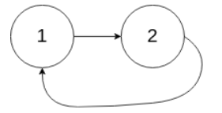

# 【基础篇 - Day 11】 2020-11-11 - 142. 环形链表 II（02. 链表 ）

## 题目描述

> ## 入选理由
>
> 1. 链表中的非常见题型-环形链表
> 2. 考察对链表中指针的熟练操作以及双指针在单链表中的灵活应用
>
> ## 题目描述
>
> 给定一个链表，返回链表开始入环的第一个节点。 如果链表无环，则返回 null。
>
> 为了表示给定链表中的环，我们使用整数 pos 来表示链表尾连接到链表中的位置（索引从 0 开始）。 如果 pos 是 -1，则在该链表中没有环。注意，pos 仅仅是用于标识环的情况，并不会作为参数传递到函数中。
>
> 说明：不允许修改给定的链表。
>
> 进阶：
>
> 你是否可以使用 O(1) 空间解决此题？
>
> 示例 1：

> 

> 输入：head = [3,2,0,-4], pos = 1
> 输出：返回索引为 1 的链表节点
> 解释：链表中有一个环，其尾部连接到第二个节点。
> 示例 2：

> 

> 输入：head = [1,2], pos = 0
> 输出：返回索引为 0 的链表节点
> 解释：链表中有一个环，其尾部连接到第一个节点。
> 示例 3：

> 

> 输入：head = [1], pos = -1
> 输出：返回 null
> 解释：链表中没有环。
>
> 提示：
>
> 链表中节点的数目范围在范围 [0, 104] 内
> -105 <= Node.val <= 105
> pos 的值为 -1 或者链表中的一个有效索引
>
> 题目地址：https://leetcode-cn.com/problems/linked-list-cycle-ii/

## 我的回答

### 解法一

#### 时空复杂度

时间复杂度：O(n)

空间复杂度: O(1)

双指针，根据公式推导出当快慢指针相遇时，新建一个指针从头开始走，和 slow 相遇时就是环的交点

```js
var detectCycle = function(head) {
  let slow = head;
  let fast = head;
  while (fast != null) {
    slow = slow.next;
    if (fast.next != null) {
      fast = fast.next.next;
    } else {
      return null;
    }

    if (slow === fast) {
      let pre = head;
      while (pre !== slow) {
        pre = pre.next;
        slow = slow.next;
      }
      return pre;
    }
  }
  return null;
};
```

### 解法二

#### 时空复杂度

时间复杂度：O(n)

空间复杂度: O(n)

Map 记录一下 比较简单

```js
var detectCycle = function(head) {
  let map = new Map();
  while (head) {
    if (map.has(head)) {
      return head;
    } else {
      map.set(head, head);
      head = head.next;
    }
  }
  return null;
};
```

## 参考回答

- [官方题解](https://github.com/leetcode-pp/91alg-2/blob/master/solution/basic/d11.142.Linked-List-Cycle-II.md)
- [精选题解](https://github.com/leetcode-pp/91alg-2/issues/34#issuecomment-724966486)
