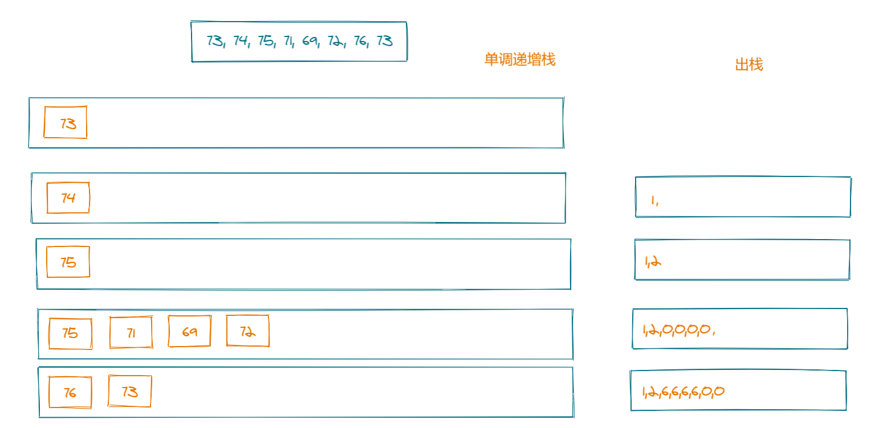

# 739. 每日温度

## 题目描述

> 请根据每日 气温 列表，重新生成一个列表。对应位置的输出为：要想观测到更高的气温，至少需要等待的天数。如果气温在这之后都不会升高，请在该位置用 0 来代替。
>
> 例如，给定一个列表 temperatures = [73, 74, 75, 71, 69, 72, 76, 73]，你的输出应该是 [1, 1, 4, 2, 1, 1, 0, 0]。
>
> 提示：气温 列表长度的范围是 [1, 30000]。每个气温的值的均为华氏度，都是在 [30, 100] 范围内的整数。
>
> 来源：力扣（LeetCode）
> 链接：https://leetcode-cn.com/problems/daily-temperatures
> 著作权归领扣网络所有。商业转载请联系官方授权，非商业转载请注明出处。

## 我的回答

### 解法一

#### 时空复杂度

时间复杂度：O(n^2)

空间复杂度: O(n)

暴力求值

```js
var dailyTemperatures = function(T) {
  const res = [];
  for (let i = 0; i < T.length; i++) {
    for (let j = i + 1; j < T.length; j++) {
      if (T[j] > T[i]) {
        res[i] = j - i;
        break;
      }
    }
    !res[i] && (res[i] = 0);
  }
  return res;
};
```

### 解法二

#### 时空复杂度

时间复杂度：O(n)

空间复杂度: O(logn)

单调栈



```js
var dailyTemperatures = function(T) {
  const res = [];
  const stack = [];
  for (let i = 0; i < T.length; i++) {
    res[i] = 0;
    while (stack.length && T[stack[stack.length - 1]] < T[i]) {
      let peek = stack.pop();
      res[peek] = i - peek;
    }
    stack.push(i);
  }
  return res;
};
```
