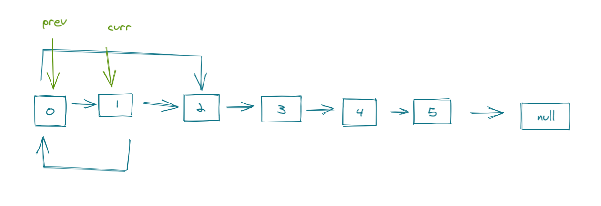

# 【基础篇 - Day 7】 2020-11-07 - 24. 两两交换链表中的节点(链表) #29

## 题目描述

> 给定一个链表，两两交换其中相邻的节点，并返回交换后的链表。
>
> 你不能只是单纯的改变节点内部的值，而是需要实际的进行节点交换。
>
> 示例 1：

<!-- >  -->

> 输入：head = [1,2,3,4]
> 输出：[2,1,4,3]
> 示例 2：
>
> 输入：head = []
> 输出：[]
> 示例 3：
>
> 输入：head = [1]
> 输出：[1]
>
> 提示：
>
> 链表中节点的数目在范围 [0, 100] 内
> 0 <= Node.val <= 100
>
> 来源：力扣（LeetCode）
> 链接：https://leetcode-cn.com/problems/swap-nodes-in-pairs
> 著作权归领扣网络所有。商业转载请联系官方授权，非商业转载请注明出处。

## 我的回答

### 解法一

#### 时空复杂度

时间复杂度：O(n)

空间复杂度: O(1)

```js
var swapPairs = function(head) {
  let newList = new ListNode(null, head);
  let prev = newList;
  let curr = prev.next;
  while (curr && curr.next) {
    // 第一轮 pre null curr 1
    const next = curr.next; // 2
    curr.next = next.next; // 1=>3
    next.next = curr; // 2 = > 1
    prev.next = next; // null = > 2
    // 往下走
    prev = curr; // 1
    curr = curr.next; // 2
  }
  return newList.next;
};
```



### 解法二

递归

```js
var swapPairs = function(head) {
  if (!head || !head.next) return head;
  const next = head.next;

  head.next = swapPairs(next.next);

  next.next = head;
  return next;
};
```

## 参考回答

- [官方题解](https://github.com/leetcode-pp/91alg-2/blob/master/solution/basic/d7.24.Swap-Nodes-in-Pairs.md)
- [精选题解](https://github.com/leetcode-pp/91alg-2/issues/29#issuecomment-723101422)
