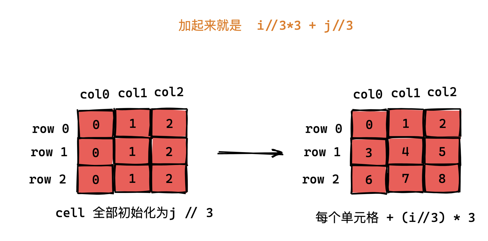

# 【Day 21】有效的数独

## 题目描述

```markdown
判断一个 9x9 的数独是否有效。只需要根据以下规则，验证已经填入的数字是否有效即可。

数字 1-9 在每一行只能出现一次。
数字 1-9 在每一列只能出现一次。
数字 1-9 在每一个以粗实线分隔的 3x3 宫内只能出现一次。

示例 1:

输入:
[
["5","3",".",".","7",".",".",".","."],
["6",".",".","1","9","5",".",".","."],
[".","9","8",".",".",".",".","6","."],
["8",".",".",".","6",".",".",".","3"],
["4",".",".","8",".","3",".",".","1"],
["7",".",".",".","2",".",".",".","6"],
[".","6",".",".",".",".","2","8","."],
[".",".",".","4","1","9",".",".","5"],
[".",".",".",".","8",".",".","7","9"]
]
输出: true
示例 2:

输入:
[
  ["8","3",".",".","7",".",".",".","."],
  ["6",".",".","1","9","5",".",".","."],
  [".","9","8",".",".",".",".","6","."],
  ["8",".",".",".","6",".",".",".","3"],
  ["4",".",".","8",".","3",".",".","1"],
  ["7",".",".",".","2",".",".",".","6"],
  [".","6",".",".",".",".","2","8","."],
  [".",".",".","4","1","9",".",".","5"],
  [".",".",".",".","8",".",".","7","9"]
]
输出: false
解释: 除了第一行的第一个数字从 5 改为 8 以外，空格内其他数字均与 示例1 相同。
但由于位于左上角的 3x3 宫内有两个 8 存在, 因此这个数独是无效的。
说明:

一个有效的数独（部分已被填充）不一定是可解的。
只需要根据以上规则，验证已经填入的数字是否有效即可。
给定数独序列只包含数字 1-9 和字符 '.' 。
给定数独永远是 9x9 形式的。

来源：力扣（LeetCode）
链接：https://leetcode-cn.com/problems/valid-sudoku
著作权归领扣网络所有。商业转载请联系官方授权，非商业转载请注明出处。
```

## 我的回答

https://github.com/leetcode-pp/91alg-1/issues/43#issuecomment-647337228

### 解法一

#### 时间复杂度 O(n * n) 这里 就是  9 *  9

#### 空间复杂度 O(3n) 

```js
      var isValidSudoku = function (board) {
          if(board === null || !board.length ) return false
        //创建一个竖向hash记录
        let Vertical = {};
        //创建一个hash记录 3*3格子
        let square = {};
        for (let i = 0; i < board.length; i++) {
          //创建一个横向hash记录
          let Transverse = {};
          let TIndex = Math.floor(i / 3);
          for (let j = 0; j < board[i].length; j++) {
            let data = board[i][j];
            if (data == ".") continue;
            if (!Vertical[j]) Vertical[j] = {};
            
            // 序列00、01、02、 10......
            let VIndex = Math.floor(j / 3);
            let Indexes = "" + TIndex + VIndex;

            if (!square[Indexes]) square[Indexes] = {};
            if ( Vertical[j][data] || Transverse[data] || square[Indexes][data] ) {
              return false;
            } else {
              Vertical[j][data] = 1;
              Transverse[data] = 1;
              square[Indexes][data] = 1;
            }
          }
        }
        return true;
      };
```


## 参考回答

> # 36. 有效的数独
> ## 前置知识
> * 哈希表
>
> ## 思路
> 该道题的描述非常清晰，我们的目的就是验证这个9*9的数独是否是有效的。对应位置的行和列是很容易遍历的，就是判断该元素属于哪个3*3的块需要注意一下，细心一点不难发现：
>
> 
>
> ```java
> which_chunk = 3 * (i / 3) + j / 3
> 其中i为对应的行，j为对应的列
> ```
>
> 只要我们确定了这三个，那么暴力做法就来了，直接就遇到个元素就判断该行，该列，该块，是否有重复的元素即可，由于代码过于暴力，有兴趣的同学可以自行实现。
>
> 用暴力题解做完后，不难发现时间复杂度是9*9*(3*9)，那么我们能否将复杂度降低呢，该题抽象出来其实就是我们之前做过的，判断某一元素是否出现过的类型题，只不过这个判断需要进行三次，一次行，一次列，还有一次块，那么我们就可以用哈希表来实现了。
>
> ## 代码
> ```java
> public boolean isValidSudoku(char[][] board) {
>         
>     // 简单的防御
>     if (board == null || board.length == 0)
>         return false;
>         
>     Set<Character>[] cols = new HashSet[9];
>     Set<Character>[] rows = new HashSet[9];
>     Set<Character>[] chunks = new HashSet[9];
>     
>     for (int i = 0; i < 9; i++) {
>         
>         cols[i] = new HashSet<>();
>         rows[i] = new HashSet<>();
>         chunks[i] = new HashSet<>();
>     }
>     
>     for (int i = 0; i < 9; i++) {
>         
>         for (int j = 0; j < 9; j++) {
>             
>             if (board[i][j] == '.')
>                 continue;
>             
>             if (!cols[j].add(board[i][j]))
>                 return false;
>             if (!rows[i].add(board[i][j]))
>                 return false;
>             if (!chunks[3 * (i / 3) + (j) / 3].add(board[i][j]))
>                 return false;
>         }
>     }
>     
>     return true;
> }
> ```
>
> 这样就把时间复杂度的3*9那部分优化掉啦，也就是相当于用空间换了时间，在某些情况下是很有必要的。
>
> ps : 记得自己动手实现输入输出
>
> 输入可以参照如下格式, 每行元素按一个空格分割：
>
> ```java
> 1 2 3 4 . 6 7 8 9
> 1 2 3 4 5 . 7 8 9
> 1 2 . 4 5 6 7 8 9
> 1 2 3 4 5 6 7 8 9
> 1 2 3 4 5 6 7 8 9
> 1 2 3 4 5 6 7 8 9
> 1 2 3 4 5 6 7 8 9
> 1 2 3 4 5 6 7 8 9
> 1 2 3 4 5 6 7 8 9
> ```
>
> **复杂度分析**
>
> * 时间复杂度：$O(1)$，由于题目的输入规模是确定的，因此时间复杂度没有意义，你非要说的话就是 $O(1)$。
> * 空间复杂度：$O(1)$，由于题目的输入规模是确定的，因此时间复杂度没有意义，你非要说的话就是 $O(1)$。