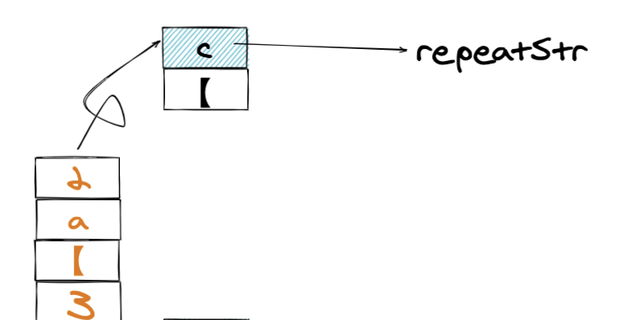
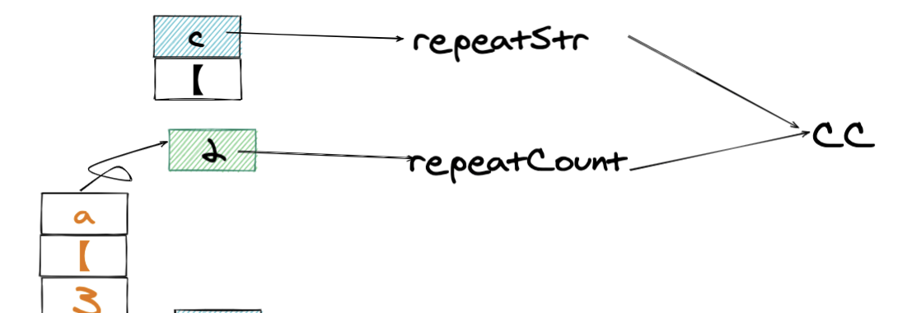
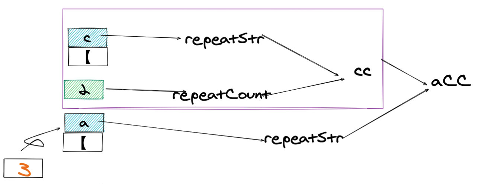

# 【Day 4】字符串解码

## 题目描述

```markdown
给定一个经过编码的字符串，返回它解码后的字符串。

编码规则为: k[encoded_string]，表示其中方括号内部的 encoded_string 正好重复 k 次。注意 k 保证为正整数。

你可以认为输入字符串总是有效的；输入字符串中没有额外的空格，且输入的方括号总是符合格式要求的。

此外，你可以认为原始数据不包含数字，所有的数字只表示重复的次数 k ，例如不会出现像 3a 或 2[4] 的输入。

示例:

s = "3[a]2[bc]", 返回 "aaabcbc".
s = "3[a2[c]]", 返回 "accaccacc".
s = "2[abc]3[cd]ef", 返回 "abcabccdcdcdef".

来源：力扣（LeetCode）
链接：https://leetcode-cn.com/problems/decode-string
著作权归领扣网络所有。商业转载请联系官方授权，非商业转载请注明出处。
```

## 我的回答

https://github.com/leetcode-pp/91alg-1/issues/20#issuecomment-638623652

### 有效的括号

#### [20. 有效的括号](https://leetcode-cn.com/problems/valid-parentheses/)

这道题有点难度 先降维打击一下

#### 题目描述

> 给定一个只包括 '('，')'，'{'，'}'，'['，']' 的字符串，判断字符串是否有效。
>
> 有效字符串需满足：
>
> 左括号必须用相同类型的右括号闭合。
> 左括号必须以正确的顺序闭合。
> 注意空字符串可被认为是有效字符串。
>
> 示例 1:
>
> 输入: "()"
> 输出: true
>
> 来源：力扣（LeetCode）
> 链接：https://leetcode-cn.com/problems/valid-parentheses
> 著作权归领扣网络所有。商业转载请联系官方授权，非商业转载请注明出处。

#### 解法一

```js
var isValid = function(s) {
  let length = s.length;
  if (length % 2) return false;
  let leftStack = [];
  for (let i = 0; i < length; i++) {
    if (s[i] == "(" || s[i] == "[" || s[i] == "{") {
      leftStack.push(s[i]);
    } else {
      let top = leftStack[leftStack.length - 1];
      if (
        (top == "(" && s[i] == ")") ||
        (top == "[" && s[i] == "]") ||
        (top == "{" && s[i] == "}")
      ) {
        // console.log(leftStack);
        leftStack.pop();
      } else {
        return false;
      }
    }
  }
  return !leftStack.length;
};
```

#### 解法二

解法一的判断明显过多

```js
var isValid = function (s) {
    let length = s.length;
    if (length % 2) return false;
    let leftStack = [];
    for (let i = 0; i < length; i++) {
        let letter = s[i];
        switch (letter) {
            case "(": {
                leftStack.push(letter);
                break;
            }
            case "[": {
                leftStack.push(letter);
                break;
            }
            case "{": {
                leftStack.push(letter);
                break;
            }
            case ")": {
                if (leftStack.pop() !== "(") return false;
                break;
            }
            case "]": {
                if (leftStack.pop() !== "[") return false;
                break;
            }
            case "}": {
                if (leftStack.pop() !== "{") return false;
                break;
            }
        }
    }
    return !leftStack.length;
};
```

### 回到正题

#### 解法一

##### 思路

设定两个栈 一个用来保存未用掉的数字，一个用来保存未保存的字母，当遇到数字和字符串累加保存，遇到 `[` ,将数字和字符串都推入各自的栈，等待遇到`]` 的时候将字符串和数字都取出来组合成一个新的字符串

##### 时间复杂度 O(n) 空间复杂度 O(2n+2)

##### 代码

```js
var decodeString = function(s) {
  let numStack = [];
  let outerStack = [];
  let string = "";
  let num = 0;
  for (const i of s) {
    let isNum = !isNaN(i);
    if (isNum) {
      num += i;
    } else if (i === "[") {
      numStack.push(num);
      num = 0;
      outerStack.push(string);
      string = "";
    } else if (i === "]") {
      let k = numStack.pop();
      string = outerStack.pop() + string.repeat(k);
    } else {
      string += i;
    }
  }
  return string;
};
```

#### 解法二

空间复杂度应该还能降低

只用一个`栈` ，将空间复杂度降低到 O(n+2)

```js
var decodeString = function(s) {
  let Stack = [];
  let string = "";
      let num = 0;
  for (const i of s) {
    let isNum = !isNaN(i);
    if (isNum) {
      num += i;
    } else if (i === "[") {
      Stack.push(num);
      Stack.push(string);
      num = 0;
      string = "";
    } else if (i === "]") {
      let s = Stack.pop();
      let k = Stack.pop();
      string = s + string.repeat(k);
    } else {
      string += i;
    }
  }
  return string;
};
```


很迷 我优化的不是空间吗

## 参考回答

###  题目地址

####  [394. 字符串解码](https://leetcode-cn.com/problems/decode-string/)

###  题目描述

给定一个经过编码的字符串，返回它解码后的字符串。

编码规则为: k[encoded_string]，表示其中方括号内部的 encoded_string 正好重复 k 次。注意 k 保证为正整数。

你可以认为输入字符串总是有效的；输入字符串中没有额外的空格，且输入的方括号总是符合格式要求的。

此外，你可以认为原始数据不包含数字，所有的数字只表示重复的次数 k ，例如不会出现像 3a 或 2[4] 的输入。

示例:

s = "3[a]2[bc]", 返回 "aaabcbc".
s = "3[a2[c]]", 返回 "accaccacc".
s = "2[abc]3[cd]ef", 返回 "abcabccdcdcdef".

###  前置知识

- 栈
- 括号匹配

###  思路

题目要求将一个经过编码的字符解码并返回解码后的字符串。
题目给定的条件是只有四种可能出现的字符

1. 字母
2. 数字
3. [
4. ]
并且输入的方括号总是满足要求的（成对出现），数字只表示重复次数

那么根据以上条件，我们可以利用stack来实现这个操作

- 遍历这个字符串s，判断每一个字符的类型
-- 如果是字母 --> 添加到stack当中
-- 如果是数字 --> 先不着急添加到stack中 --> 因为有可能有多位
-- 如果是 [ --> 说明重复字符串开始 --> 将数字入栈 --> 并且将数字清零
-- 如果是 ] --> 说明重复字符串结束 --> 将重复字符串重复前一步储存的数字遍

拿题目给的例子`s = "3[a2[c]]"` 来说：


在遇到 ` 】` 之前，我们不断执行压栈操作：


当遇到 `】`的时候，说明我们应该出栈了，不断出栈知道对应的`【`，这中间的就是 repeatStr。



但是要重复几次呢？ 我们需要继续出栈，直到非数字为止，这个数字我们记录为 repeatCount。



而最终的字符串就是 repeatCount 个 repeatStr 拼接的形式。 **并将其看成一个字母压入栈中**。




继续，后面的逻辑是一样的：


（最终图）

### 代码

JavaScript：

```js
   /**

* @param {string} s

* @return {string}

*/

var decodeString = function(s) {
    var stack = []
    var factor = ''  // repeat time
    for(let i = 0; i < s.length; i++) {
	    var el = s[i]
	    if(/[0-9]/.test(el)) {
		    factor += el
	    } else  if(el === '[') {
		    if(factor) {
				stack.push(factor - 0)
		    }
		    factor = ''
	    } else  if(el === ']') {
		    var char = stack.pop()
		    var str = ''
		    while(typeof char !== 'number') {
			    str = char + str // note: stack -> LIFO -> the string is reversed
			    char = stack.pop()
		    }
		    stack.push(str.repeat(char))
	    } else {
		    stack.push(el)
	    }
	}
    return stack.join('')
};
```

Python：

```py
class Solution:
    def decodeString(self, s: str) -> str:
        stack = []
        for c in s:
            if c == ']':
                repeatStr = ''
                repeatCount = ''
                while stack and stack[-1] != '[':
                    repeatStr = stack.pop() + repeatStr
                # pop 掉 "["
                stack.pop()
                while stack and stack[-1].isnumeric():
                    repeatCount = stack.pop() + repeatCount
                stack.append(repeatStr * int(repeatCount))
            else:
                stack.append(c)
        return "".join(stack)
```

***复杂度分析***
- 时间复杂度：$O(N)$，其中 N 为 s 长度。
- 空间复杂度：$O(N)$，其中 N 为 s 长度。


